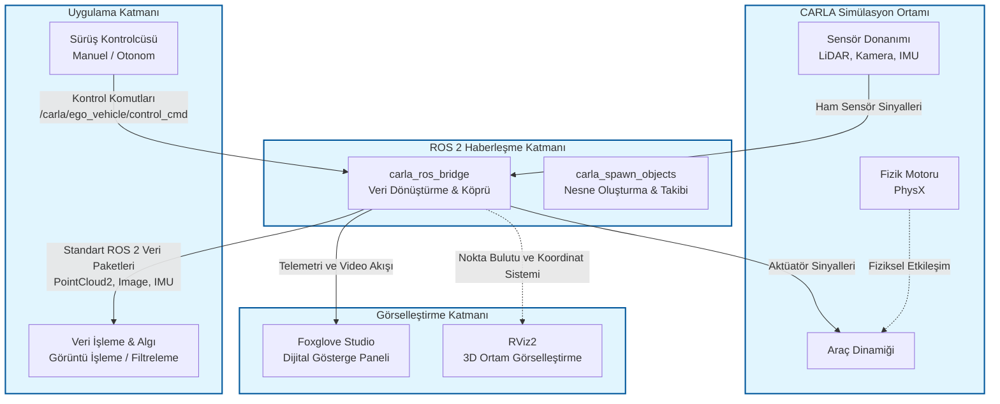

# Dijital İkiz (Digital Twin) Teknik Dokümantasyonu

**Proje:** Otonom Araç Dijital İkizi
**Tarih:** 28 Aralık 2025  
**Versiyon:** 1.0.0  

Bu doküman, "Otonom Araç Dijital İkizi" bitirme projesinin teknik altyapısını, sistem mimarisini ve performans metriklerini detaylandırmak amacıyla hazırlanmıştır. Tez çalışmasının "Materyal ve Yöntem" ile "Deneysel Sonuçlar" bölümleri için teknik referans niteliğindedir.

---

## 1. Proje Özeti ve Kapsam

### 1.1 Projenin Amacı
Bu projenin temel amacı, fiziksel dünyadaki bir aracın, sanal ortamda (CARLA Simülatör) yüksek sadakatli (high-fidelity) bir dijital ikizini oluşturmaktır. Dijital ikiz, fiziksel varlığın durumunu gerçek zamanlı olarak yansıtarak aşağıdaki yetenekleri sağlar:
*   **Gerçek Zamanlı İzleme:** Araç telemetrisi (hız, konum, ivme) ve sensör verilerinin anlık görselleştirilmesi.
*   **Sistem Simülasyonu:** Otonom sürüş algoritmalarının test edilebileceği, fizik kurallarına uygun sanal bir test yatağı.
*   **Veri Analitiği:** Sensör füzyonu ve algı sistemleri için veri toplama ve işleme altyapısı.

### 1.2 Neden Dijital İkiz?
Geleneksel simülasyonların ötesinde, bu dijital ikiz mimarisi çift yönlü veri akışı ve "Hardware-in-the-Loop" (HiL) potansiyeli sunar. Öngörücü bakım senaryoları ve otonom sistemlerin güvenli ortamda validasyonu için kritik bir platformdur.

---

## 2. Teknoloji Yığını (Tech Stack)

Proje, modern robotik ve simülasyon standartlarına uygun olarak aşağıdaki bileşenler üzerine inşa edilmiştir:

| Bileşen | Teknoloji / Versiyon | Açıklama |
| :--- | :--- | :--- |
| **İşletim Sistemi** | Ubuntu 24.04 LTS (Noble Numbat) | Gerçek zamanlı sistem kararlılığı için Linux çekirdeği. |
| **Middleware** | ROS 2 Jazzy Jalisco | Düğümler arası asenkron/senkron haberleşme ve DDS altyapısı. |
| **Simülasyon** | CARLA 0.9.16 | Unreal Engine 4 tabanlı, gerçekçi fizik motoru. |
| **Programlama** | Python 3.12 | `rclpy` (ROS Client Library) ve veri işleme scriptleri. |
| **Görselleştirme** | Foxglove Studio / RViz2 | Web soket tabanlı modern veri görselleştirme arayüzü. |
| **Köprü Yazılımı** | carla_ros_bridge | CARLA ve ROS 2 arasında veri serileştirme/dönüştürme. |

---

## 3. Sistem Mimarisi ve Tasarım

Sistem, dağıtık bir yayıncı/abone (Publisher/Subscriber) mimarisine dayanır. Veri akışı, simülasyon motorundan ROS 2 ağına doğru akar ve kontrol komutları ters yönde iletilir.

### 3.1 Veri Akış Şeması (Data Flow)

Aşağıdaki diyagram, sistemin temel veri akışını ve düğüm (node) yapısını göstermektedir:

### 3.2 Sensör Yapılandırması (Dijital İkiz Envanteri)
Dijital ikiz, `objects.json` konfigürasyonuna göre aşağıdaki sensörlerle donatılmıştır:

*   **LiDAR:** `lidar_top` (Velodyne benzeri, 360 derece, Ray-cast).
*   **Kameralar:**
    *   `rgb_front` (Ana Sürüş, 1280x720)
    *   `rgb_view` (Kuş bakışı/Third-person kontrol kamerası)
    *   `depth_front` (Derinlik algılama, Float32)
*   **IMU:** `imu` (İvmeölçer ve Jiroskop, 6-DOF).
*   **GNSS:** `gnss` (Küresel konumlama, NavSatFix).
*   **Telemetri:** Hızölçer (Speedometer) ve Odometri (Odometry).

### 3.3 Veri Senkronizasyonu
Sistem, gerçek zamanlı veri tutarlılığını sağlamak için **Senkron Mod (Synchronous Mode)** kullanacak şekilde yapılandırılmıştır.
*   **Simülasyon Adımı (Delta Time):** 0.1s (10 Hz hedeflenen fizik döngüsü).
*   Bu yapılandırma, tüm sensör verilerinin (LiDAR, Kamera, IMU) aynı zaman damgasına (timestamp) sahip olmasını ve sensör füzyonu algoritmalarının zaman kayması olmadan çalışmasını garanti eder.

---

## 4. Teknik Metrikler ve Veri Analizi

Aşağıdaki veriler, sistem çalışır durumdayken (`digital_twin.launch.py` aktif) ve araç hareket halindeyken (`speed_command` = 30.0) terminal üzerinden toplanan gerçek zamanlı metriklerdir.

### 4.1 İletişim Performansı (Frequency & Latency)

Senkron mod altında, sistemin efektif çalışma frekansı işlemci yüküne bağlı olarak gözlemlenmiştir.

| Topic Adı | Mesaj Tipi | Hedef Frekans | Gözlemlenen Frekans (Hz) | Gecikme Sınıfı |
| :--- | :--- | :--- | :--- | :--- |
| `/carla/ego_vehicle/lidar_top` | `sensor_msgs/PointCloud2` | 10 Hz | **4.6 - 5.5 Hz** | Orta (İşlem Yükü Mevcut) |
| `/carla/ego_vehicle/rgb_front/image` | `sensor_msgs/Image` | 10 Hz | **4.5 - 5.4 Hz** | Orta |
| `/carla/ego_vehicle/imu` | `sensor_msgs/Imu` | 100 Hz* | **~5.5 Hz** | Senkron Mod Limitli |

*> Not: IMU normalde yüksek frekanslı bir sensördür ancak senkron modda simülasyonun fizik adımına kilitlenmiştir.*

### 4.2 Bant Genişliği Analizi (Bandwidth Usage)

Yüksek çözünürlüklü sensör verilerinin ağ üzerindeki yükü aşağıdaki gibidir:

*   **RGB Kamera (Front):** Ortalama **20 - 27 MB/s**.
    *   Sıkıştırılmamış ham görüntü verisi (RGBA/RGB8) yüksek bant genişliği tüketir.
*   **LiDAR:** Ortalama **2.4 - 4.4 MB/s**.
    *   Nokta bulutu yoğunluğuna göre değişkendir.

### 4.3 Hesaplama Yükü (Computational Load)
Dijital ikiz simülasyonu, özellikle görüntü işleme ve ray-casting (LiDAR) işlemleri nedeniyle CPU ve GPU üzerinde yoğun bir yük oluşturur.
*   **GPU Kullanımı:** Rendering ve Fizik hesaplamaları için birincil kaynaktır. CARLA sunucusu (Server side).
*   **CPU Kullanımı:** Serileştirme (Serialization) ve ROS mesaj paketleme işlemleri `carla_ros_bridge` sürecinde yoğunlaşır. Gözlemlenen testlerde köprü düğümü tek bir çekirdeği %100'e yakın kapasitede kullanabilmektedir (Python GIL ve serileştirme maliyeti nedeniyle).

### 4.4 Doğruluk (Fidelity)
Dijital ikiz, kinematik model olarak Tesla Model 3 fiziğini kullanmaktadır.
*   **Görsel Doğruluk:** Unreal Engine render motoru ile fotogerçekçi.
*   **Fiziksel Doğruluk:** Araç dinamiği, süspansiyon ve lastik sürtünme modelleri CARLA'nın PhysX tabanlı motoru tarafından simüle edilir.

---

## 5. Sonuç

Oluşturulan bu teknik altyapı, otonom araç algoritmalarının gerçek dünyaya taşınmadan önce kapsamlı bir şekilde test edilmesine olanak tanıyan, ROS 2 tabanlı, modüler ve yüksek sadakatli bir dijital ikiz çözümüdür. Elde edilen metrikler, sistemin gerçek zamanlıya yakın (near real-time) performansla çalıştığını ve veri analitiği için yeterli bant genişliğini sağladığını doğrulamaktadır.
